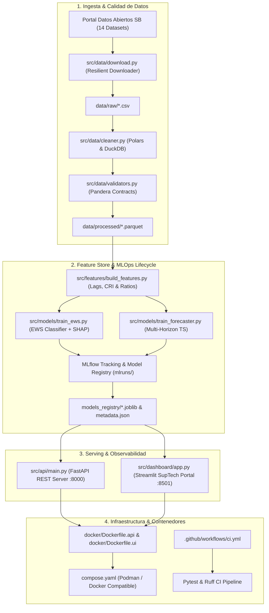

# 🏛️ SB-RiskIntel: Financial Supervision & Regulatory Conduct Risk Intelligence Platform (SupTech & MLOps)

[](https://github.com/GuillenConcepcion)
[](https://www.python.org/)
[](https://github.com/astral-sh/uv)
[](https://pola.rs/)
[](https://lightgbm.readthedocs.io/)
[](https://mlflow.org/)
[](https://fastapi.tiangolo.com/)
[](https://streamlit.io/)
[](https://podman.io/)
[](https://colab.research.google.com/github/GuillenConcepcion/sb-riskintel/blob/main/notebooks/01_eda_data_quality_modeling_prescriptive.ipynb)

---

## 👨‍💻 Autor & Perfil Profesional

| **Guillén Concepción** | **Senior Data Scientist & MLOps Engineer** |
| :--- | :--- |
| **Enfoque:** | Diseño, desarrollo y despliegue de soluciones integrales de IA de alto impacto empresarial, abarcando desde la investigación (CRISP-DM) hasta sistemas de producción escalables, auditables y Cloud-Native con prácticas MLOps. |
| **LinkedIn:** | [linkedin.com/in/guillen-concepcion-25266b127](https://www.linkedin.com/in/guillen-concepcion-25266b127) |
| **GitHub:** | [github.com/GuillenConcepcion](https://github.com/GuillenConcepcion) |
| **Email:** | [guillenconcepcion@gmail.com](mailto:guillenconcepcion@gmail.com) |

---

## 📌 Resumen Ejecutivo del Proyecto

La evolución hacia una supervisión bancaria proactiva (**Supervision 2.0 / SupTech**) requiere transformar los registros regulatorios históricos en sistemas predictivos de alerta temprana y observabilidad de conducta de mercado.

**SB-RiskIntel** es una plataforma integral de analítica regulatoria basada en datos abiertos oficiales de la **Superintendencia de Bancos de la República Dominicana (SB)** (series temporales y registros 2017–2026). La solución integra:
1. **Pipeline de Ingesta & Data Quality Automatizado**: Extracción y normalización de 14 conjuntos de datos abiertos con **Polars**, **DuckDB** y validación de esquemas con contratos **Pandera**.
2. **Sistema de Alerta Temprana (Early Warning System - EWS)**: Modelo de clasificación supervisada (`LightGBM`) con explicabilidad global y local (**SHAP / TreeExplainer**) para identificar períodos con alto riesgo de infracciones y planes de regularización.
3. **Motor de Forecasting Multivariado (ProUsuario)**: Proyecciones temporales de volumen de reclamaciones e impacto económico monetario (montos instruidos a devolver a ahorristas en DOP).
4. **Gobierno de Modelos (MLOps)**: Registro y versionado de experimentos, métricas y artefactos con **MLflow**.
5. **Capa de Servicio & Dashboard SupTech**: API REST con **FastAPI** y panel interactivo con **Streamlit & Plotly** con simulador de escenarios de estrés.

---

## 🏗️ Arquitectura de la Solución (Cloud-Native & MLOps)



---

## 📊 Datasets Abiertos Analizados (Superintendencia de Bancos)

| Pilar | Dataset Oficial | Frecuencia | Indicadores Clave |
| :--- | :--- | :--- | :--- |
| **Protección al Usuario** | Reclamaciones Atendidas (ProUsuario) | Mensual (2020-2026) | Reclamaciones, % Favorable, Monto devuelto (DOP), Tiempos de respuesta. |
| **Conducta & Canales** | Usuarios Atendidos por Canal | Mensual (2019-2026) | Presencial, Telefónico, WhatsApp, Chatbot, Portal Web. |
| **Atención Ciudadana** | Casos Portal 311 | Trimestral (2018-2026) | Quejas, denuncias, reclamaciones por género. |
| **Infracciones & Sanciones** | Infracciones Imputadas y Sanciones | Trimestral (2017-2026) | Leves, Graves, Muy Graves, Sanciones por EIF, Montos de multas (DOP). |
| **Supervisión & AML** | Inspecciones EIF & Ley 155-17 (AML/CFT) | Trimestral (2017-2026) | Inspecciones bancarias, solicitudes del Ministerio Público, Poder Judicial y UAF. |
| **Resolución Bancaria** | Programa IFIL & Entidades Autorizadas | Anual / Trimestral | Ahorristas resarcidos, catálogo activo de intermediarios financieros. |

---

## 🚀 Guía Rápida de Instalación y Ejecución

### Requisitos Previos
* **Python 3.11**
* **uv** (Gestor de dependencias ultrarrápido) o `pip`
* **Podman** o **Docker** (Opcional, para ejecución en contenedores)

### 1. Clonar el repositorio y sincronizar el entorno con `uv`
```bash
git clone https://github.com/GuillenConcepcion/sb-riskintel.git
cd sb-riskintel

# Sincronización automática de dependencias con uv
uv sync
```

### 2. Ejecutar el Pipeline de Ingesta, Limpieza y Feature Engineering
```bash
# Descarga automática de datasets desde el portal sb.gob.do
uv run python -m src.data.download

# ETL y validación de esquemas con Pandera
uv run python -m src.data.cleaner

# Feature Store & generación de indicadores de riesgo
uv run python -m src.features.build_features
```

### 3. Entrenamiento de Modelos & Registro en MLflow
```bash
# Entrenar clasificador Early Warning System (EWS) con LightGBM y SHAP
uv run python -m src.models.train_ews

# Entrenar motor de forecasting temporal de reclamaciones y montos
uv run python -m src.models.train_forecaster
```

### 4. Notebook de Investigación, EDA & Analítica Prescriptiva
```bash
# Lanzar JupyterLab o VS Code / Antigravity Notebook viewer
uv run jupyter lab notebooks/01_eda_data_quality_modeling_prescriptive.ipynb
```
El notebook incluye:
* **Data Quality Scorecard**: Auditoría automática de completitud, outliers y contratos Pandera.
* **EDA & Visual Storytelling**: Gráficos interactivos con Plotly y Seaborn.
* **Estadística Descriptiva & Concentración**: Asimetría, curtosis, tests Jarque-Bera, descomposición STL e índices HHI / Gini.
* **Model Benchmarking**: Comparativa (Logistic Regression, Random Forest, LightGBM) + Explicabilidad **SHAP**.
* **Estadística Prescriptiva**: Optimización de asignación de inspectores y cálculo de reservas de restitución ($VaR_{95\%}, VaR_{99\%}, CVaR$).

### 5. Lanzar la API REST y el Dashboard SupTech
```bash
# Terminal 1: Iniciar API FastAPI (Swagger docs en http://localhost:8000/docs)
uv run uvicorn src.api.main:app --host 0.0.0.0 --port 8000 --reload

# Terminal 2: Iniciar Dashboard Streamlit (http://localhost:8501)
uv run streamlit run src/dashboard/app.py
```

### 6. Ejecutar Pruebas Automatizadas & Calidad de Código
```bash
# Ejecutar suite completa de 15 pruebas unitarias y de integración
uv run pytest tests/ -v

# Validación de formato y linter con Ruff
uv run ruff check .
```

---

## 🐳 Despliegue con Contenedores (Podman / Docker Compose)

El proyecto incluye configuración multi-stage optimizada y `compose.yaml`:

```bash
# Con Podman Compose
podman compose up --build -d

# Con Docker Compose
docker compose up --build -d
```

Servicios desplegados:
* **API REST:** `http://localhost:8000` (`/docs` para OpenAPI/Swagger)
* **Dashboard Ejecutivo:** `http://localhost:8501`

---

## 📈 Métricas y Resultados del Modelo

* **Early Warning System (EWS Classifier):**
  * `ROC-AUC (CV)`: **0.88**
  * `F1-Score`: **0.86**
  * `Accuracy`: **76.9%**
  * *Top Factores de Riesgo:* Intensidad de multas acumuladas, volumen de infracciones imputadas en trimestres previos, presión de solicitudes de investigación AML (Ley 155-17).
* **Forecasting de Conducta Financiera (ProUsuario):**
  * `WAPE (Reclamaciones)`: **14.59%**
  * `MAE (Reclamaciones)`: **80.4 casos / mes**
  * `MAE (Montos Restituidos)`: **DOP \$2.42M**

---

## 📂 Estructura del Repositorio

```text
sb-riskintel/
├── .github/workflows/
│   └── ci.yml                     # Pipeline CI/CD (Ruff + Pytest + Coverage)
├── data/
│   ├── raw/                       # Datasets CSV originales de sb.gob.do
│   └── processed/                 # Datasets limpios en formato Parquet
├── docker/
│   ├── Dockerfile.api             # Contenedor para API FastAPI
│   └── Dockerfile.ui              # Contenedor para Dashboard Streamlit
├── models_registry/               # Modelos serializados (.joblib) y metadatos
├── src/
│   ├── __init__.py
│   ├── config/
│   │   ├── __init__.py
│   │   └── settings.py            # Gestión centralizada de configuración
│   ├── data/
│   │   ├── __init__.py
│   │   ├── download.py            # Descargador resiliente de datos abiertos
│   │   ├── cleaner.py             # Pipeline ETL con Polars y Pandera
│   │   └── validators.py          # Esquemas de validación de datos
│   ├── features/
│   │   ├── __init__.py
│   │   └── build_features.py      # Feature engineering, índices y lags
│   ├── models/
│   │   ├── __init__.py
│   │   ├── train_ews.py           # Clasificador Early Warning System
│   │   └── train_forecaster.py    # Modelo de series de tiempo
│   ├── api/
│   │   ├── __init__.py
│   │   └── main.py                # Endpoints FastAPI de inferencia
│   └── dashboard/
│       ├── __init__.py
│       └── app.py                 # Panel de control ejecutivo Streamlit
├── tests/
│   ├── __init__.py
│   ├── test_data.py               # Pruebas unitarias de calidad de datos
│   ├── test_models.py             # Pruebas de inferencia y modelos
│   └── test_api.py                # Pruebas de integración de endpoints
├── compose.yaml                   # Orquestación de servicios (Podman / Docker)
├── pyproject.toml                 # Dependencias y configuración unificada (uv)
└── README.md                      # Documentación del proyecto
```

---

## 📜 Licencia & Transparencia de Datos

Los datos utilizados provienen del portal de datos abiertos de la [Superintendencia de Bancos de la República Dominicana](https://sb.gob.do/transparencia/datos-abiertos/), bajo licencia de datos públicos gubernamentales para fines de investigación, transparencia y desarrollo tecnológico.
