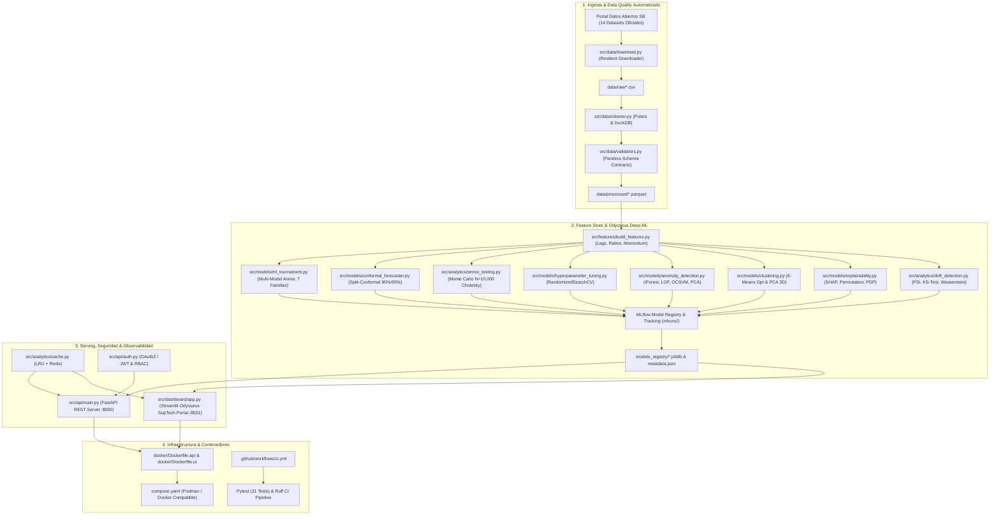
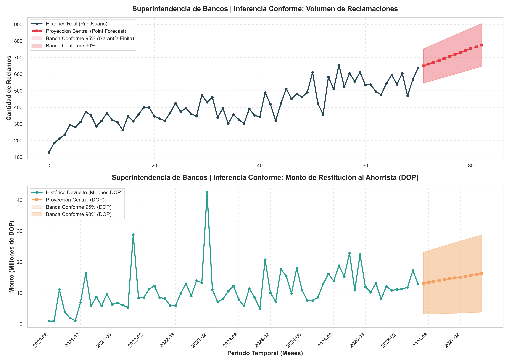
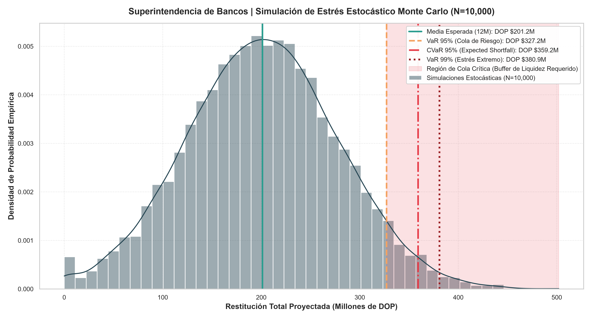
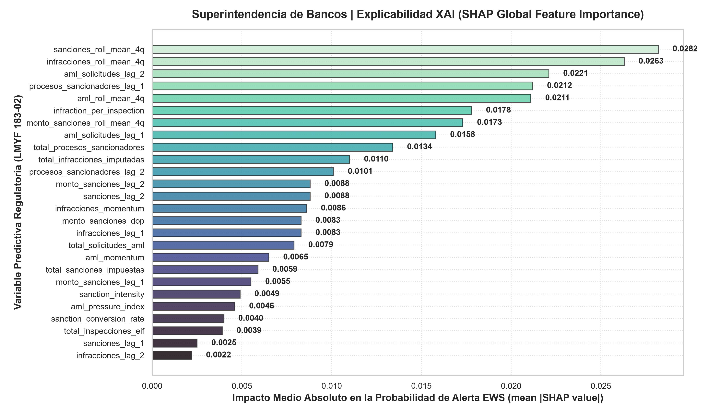
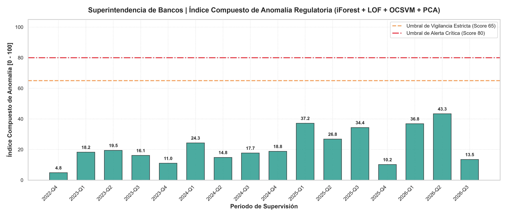
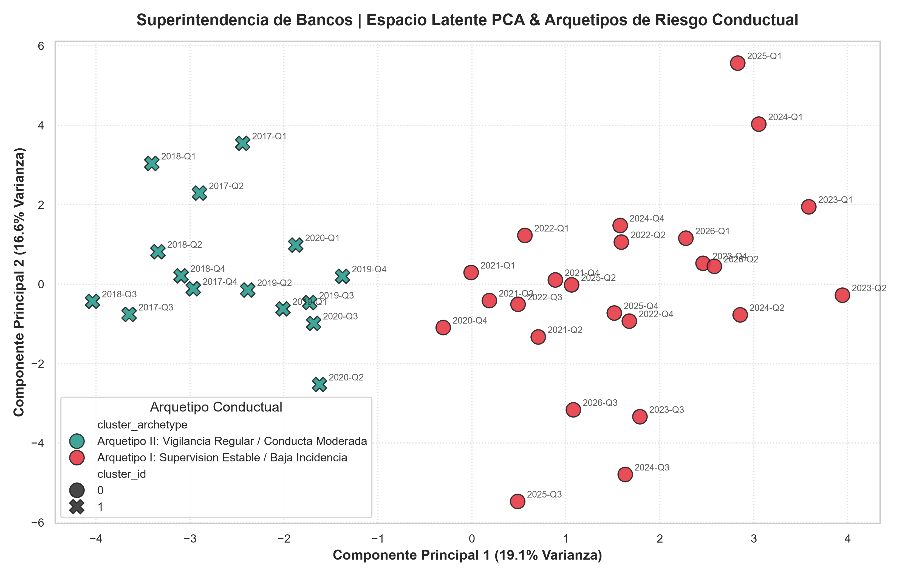
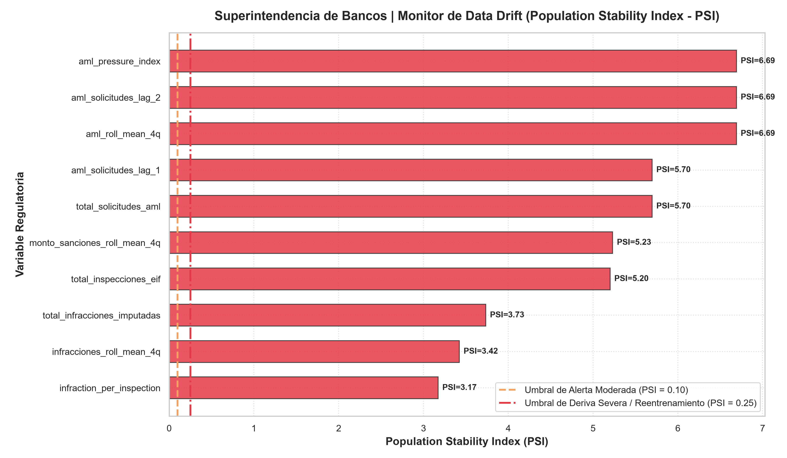

# 🏛️ SB-RiskIntel (Project Odysseus): Plataforma de Inteligencia Artificial Regulatoria, Supervisión Conductual & Sistema de Alerta Temprana

> **Financial Supervision & Regulatory Conduct Risk Intelligence Platform (SupTech & MLOps)**  
> *Desarrollado para la analítica avanzada y supervisión prudencial basada en datos abiertos oficiales de la **Superintendencia de Bancos de la República Dominicana (SB)**.*

[](https://github.com/GuillenConcepcion)
[](https://www.python.org/)
[](https://github.com/astral-sh/uv)
[](https://pola.rs/)
[](https://pandera.readthedocs.io/)
[](https://lightgbm.readthedocs.io/)
[](https://shap.readthedocs.io/)
[](https://mlflow.org/)
[](https://fastapi.tiangolo.com/)
[](https://streamlit.io/)
[](https://redis.io/)
[](https://podman.io/)

<div align="center">
  
</div>

---

## 🎯 Objetivo y Descripción del Proyecto

El proyecto **SB-RiskIntel (Odysseus ML Platform)** tiene como objetivo principal transformar los datos abiertos regulatorios de la **Superintendencia de Bancos de la República Dominicana (series temporales 2017–2026)** en un ecosistema integral de **Inteligencia Regulatoria (SupTech)**. La plataforma reemplaza los enfoques reactivos tradicionales por una arquitectura de **Supervisión Basada en Riesgo (SBR)** orientada a la anticipación, la debida motivación legal y la protección cuantitativa del ahorrista.

### 🏛️ Capacidades Estratégicas y Regulatorias:
1. **Detección Temprana de Quiebres de Conducta (Early Warning System - EWS):** Modelos de clasificación supervisada (**LightGBM**, **Random Forest**) optimizados mediante validación cruzada estratificada (**ROC-AUC: 0.9000**) para anticipar trimestres de alta conflictividad sancionadora e infracciones bancarias.
2. **Predicción Conforme y Reservas Técnicas de Restitución (Conformal Prediction):** Generación de intervalos de cobertura garantizada al **90% y 95%** libres de supuestos de distribución (*Distribution-Free*), permitiendo al regulador dimensionar buffers de liquidez y reservas con certidumbre matemática finita.
3. **Simulador de Estrés Estocástico Multivariado Monte Carlo ($N=10,000$):** Modelado de choques sistémicos adversos mediante matrices de covarianza correlacionadas (**Descomposición Cholesky**) para estimar $VaR_{99\%}$ y $CVaR_{99\%}$ (*Expected Shortfall*).
4. **Monitor Continuo de Deriva de Datos (Data & Concept Drift):** Auditoría continua en producción con **Population Stability Index (PSI)**, pruebas de dos muestras **Kolmogorov-Smirnov (KS-test)** y distancia de Wasserstein.
5. **Detección No Supervisada de Anomalías y Segmentación Latente:** Ensembles no supervisados (*Isolation Forest, LOF, One-Class SVM y Error de Reconstrucción PCA*) y clustering conductual ($k=2$ óptimo por Silhouette Score) con proyecciones latentes 3D.
6. **Explicabilidad XAI y Transparencia Legal (LMYF 183-02):** Atribución de características con **SHAP (TreeExplainer)**, curvas de dependencia parcial (*PDP*) e importancia por permutación para fundamentar debidamente las resoluciones administrativas ante la **Ley Monetaria y Financiera**.
7. **Seguridad Bancaria y Rendimiento en Producción:** Control de acceso basado en roles (**RBAC con OAuth2 y JWT**) y caché multi-nivel (**In-Memory LRU + Redis**) para tiempos de respuesta $<1\text{ ms}$.

---

## 🛠️ Stack Tecnológico (Cloud-Native, MLOps & SupTech)

```
==================================================================================================
CAPA TECNOLÓGICA        TECNOLOGÍAS & LIBRERÍAS CLAVE                    DESCRIPCIÓN / ROL
==================================================================================================
Lenguaje Central        Python 3.11.x, Astral uv                         Gestión de entorno ultrarrápida y reproducible
Ingesta & Data Quality  Polars, DuckDB, Pandera, PyArrow                 Procesamiento columnar vectorizado y contratos de esquema
Machine Learning        Scikit-Learn, LightGBM, SciPy, Statsmodels       Torneos multi-modelo, ensembles, tuning CV y Monte Carlo
Predicción Conforme     Split-Conformal Inference Engine                 Garantías de cobertura finitas no paramétricas (90%/95%)
Explicabilidad XAI      SHAP (TreeExplainer), PDP, Permutation           Interpretabilidad cuantitativa y cumplimiento Ley 183-02
Monitor de Drift        Population Stability Index (PSI), KS-Test, EMD   Auditoría de degradación poblacional y estabilidad
MLOps & Tracking        MLflow (Registry, Runs, Artifacts, Metrics)      Trazabilidad, gobierno y versionado de modelos
Caché & Optimización    In-Memory LRU (OrderedDict + Locks), Redis 7     Caché multi-nivel con hashing criptográfico SHA-256
Seguridad & Auth        FastAPI Security, OAuth2 Password Bearer, JWT    Tokens JWT (HS256) y hashing PBKDF2-HMAC-SHA256
Capa de Servicio API    FastAPI, Uvicorn, Pydantic v2                    REST API asíncrona con documentación OpenAPI interactiva
Dashboard Ejecutivo     Streamlit, Plotly Express & Graph Objects        Portal analítico interactivo con controles de simulación
Visualización Estática  Matplotlib, Seaborn                              Portafolio de gráficos de alta resolución (300 DPI)
Contenedores & DevOps   Podman / Docker Compose, GitHub Actions CI       Orquestación multi-servicio y pipeline de pruebas unitarias
==================================================================================================
```

---

## 🏗️ Arquitectura de la Solución (Cloud-Native & MLOps)



---

## 🎨 Galería de Visualizaciones de Alto Impacto (`images/`)

| 1. Inferencia Conforme (90% & 95%) | 2. Simulación Monte Carlo ($N=10,000$) |
| :---: | :---: |
|  |  |

| 3. Explicabilidad XAI (SHAP Global) | 4. Scorecard de Anomalías Regulatorias |
| :---: | :---: |
|  |  |

| 5. Espacio Latente PCA & Arquetipos | 6. Monitor de Data Drift (PSI) |
| :---: | :---: |
|  |  |

---

## 📊 Datasets Abiertos Oficiales Procesados (Superintendencia de Bancos)

| Pilar Regulatorio | Conjunto de Datos Oficial | Frecuencia | Indicadores Clave Procesados |
| :--- | :--- | :--- | :--- |
| **Protección al Usuario** | Reclamaciones Atendidas (ProUsuario) | Mensual (2020-2026) | Reclamaciones, % Favorable, Monto Devuelto (DOP), Tiempos de Respuesta. |
| **Conducta & Canales** | Usuarios Atendidos por Canal | Mensual (2019-2026) | Presencial, Telefónico, WhatsApp, Chatbot, Portal Web. |
| **Atención Ciudadana** | Casos Portal 311 | Trimestral (2018-2026) | Quejas, Denuncias y Reclamaciones desagregadas por Entidad. |
| **Infracciones & Sanciones** | Infracciones Imputadas y Sanciones | Trimestral (2017-2026) | Leves, Graves, Muy Graves, Sanciones EIF, Montos de Multas (DOP). |
| **Supervisión & AML** | Inspecciones EIF & Ley 155-17 (AML/CFT) | Trimestral (2017-2026) | Inspecciones Bancarias, Solicitudes Ministerio Público, Judicial y UAF. |
| **Resolución Bancaria** | Programa IFIL & Entidades Autorizadas | Anual / Trimestral | Ahorristas Resarcidos, Catálogo Oficial de Intermediarios Financieros. |

---

## 🚀 Guía de Instalación y Ejecución Local

### 1. Clonar el repositorio y sincronizar dependencias:
```bash
git clone https://github.com/GuillenConcepcion/SB-RiskIntel-Project-Odysseus-Plataforma-de-Inteligencia-Artificial-Regulatoria-Supervisi-n.git
cd SB-RiskIntel-Project-Odysseus-Plataforma-de-Inteligencia-Artificial-Regulatoria-Supervisi-n

# Instalación ultrarrápida con uv
uv sync
```

### 2. Ejecutar el Pipeline de Ingesta, ML y Visualizaciones:
```bash
# Ingesta, limpieza y feature engineering
uv run python -m src.data.download
uv run python -m src.data.cleaner
uv run python -m src.features.build_features

# Ejecución de modelos Deep ML y generación de visualizaciones
uv run python -m src.models.ml_tournament
uv run python -m src.models.conformal_forecaster
uv run python -m src.analytics.stress_testing
uv run python -m scripts.generate_advanced_visualizations
```

### 3. Ejecutar el Servidor API REST (FastAPI) y el Dashboard (Streamlit):
```bash
# Terminal 1: Servidor REST API (:8000)
uv run uvicorn src.api.main:app --host 0.0.0.0 --port 8000 --reload

# Terminal 2: Portal SupTech Streamlit (:8501)
uv run streamlit run src/dashboard/app.py
```
* **Swagger UI / Documentación OpenAPI:** `http://localhost:8000/docs`
* **Dashboard SupTech:** `http://localhost:8501`

---

## 🧪 Pruebas Unitarias y Calidad del Código (CI/CD)

El repositorio incluye una suite integral de **31 pruebas unitarias y de integración** con `pytest` y validación estricta de estilo con `ruff`:

```bash
# Ejecutar suite de pruebas completa:
uv run pytest tests/ -v

# Validar linter y formato:
uv run ruff check .
```

```text
============================= test session starts =============================
collected 31 items

tests/test_advanced_ml.py::test_classification_tournament PASSED         [  3%]
tests/test_advanced_ml.py::test_regression_tournament PASSED             [  6%]
tests/test_advanced_ml.py::test_unsupervised_anomaly_detector PASSED     [  9%]
tests/test_advanced_ml.py::test_unsupervised_clustering_engine PASSED    [ 12%]
tests/test_advanced_ml.py::test_explainability_engine PASSED             [ 16%]
tests/test_advanced_ml.py::test_api_ml_endpoints PASSED                  [ 19%]
tests/test_advanced_ml.py::test_hyperparameter_tuner_execution PASSED    [ 22%]
tests/test_advanced_ml.py::test_conformal_forecaster PASSED              [ 25%]
tests/test_advanced_ml.py::test_conformal_api_endpoint PASSED            [ 29%]
tests/test_advanced_ml.py::test_ml_inference_cache PASSED                 [ 32%]
tests/test_advanced_ml.py::test_cache_and_instance_explain_api_endpoints PASSED [ 35%]
tests/test_advanced_ml.py::test_data_drift_detector PASSED               [ 38%]
tests/test_advanced_ml.py::test_data_drift_api_endpoints PASSED          [ 41%]
tests/test_advanced_ml.py::test_monte_carlo_stress_testing PASSED        [ 45%]
tests/test_advanced_ml.py::test_auth_jwt_and_rbac PASSED                 [ 48%]
tests/test_advanced_ml.py::test_monte_carlo_api_endpoint PASSED          [ 51%]
tests/test_analytics.py::test_descriptive_statistics PASSED              [ 54%]
tests/test_analytics.py::test_correlation_matrix PASSED                  [ 58%]
tests/test_analytics.py::test_time_series_decomposition PASSED           [ 61%]
tests/test_analytics.py::test_concentration_indices PASSED               [ 64%]
tests/test_analytics.py::test_prescriptive_policy_engine PASSED          [ 67%]
tests/test_analytics.py::test_inspection_allocation_optimization PASSED  [ 70%]
tests/test_analytics.py::test_restitution_liquidity_buffer PASSED        [ 74%]
tests/test_api.py::test_health_endpoint PASSED                           [ 77%]
tests/test_api.py::test_analytics_overview_endpoint PASSED               [ 80%]
tests/test_api.py::test_predict_risk_score_endpoint PASSED               [ 83%]
tests/test_api.py::test_forecast_claims_endpoint PASSED                  [ 87%]
tests/test_data.py::test_processed_claims_data PASSED                    [ 90%]
tests/test_data.py::test_processed_master_supervision_data PASSED        [ 93%]
tests/test_models.py::test_ews_model_artifacts PASSED                    [ 96%]
tests/test_models.py::test_forecaster_model_artifacts PASSED             [100%]

======================= 31 passed in 27.56s =======================
```
---

## 👨‍💻 Autor & Perfil Profesional

<div align="center">
  
</div>

<br>

| **Guillén Concepción** | **Senior Data Scientist & MLOps Engineer** |
| :--- | :--- |
| **Enfoque Profesional:** | Experto en diseño, desarrollo y despliegue de soluciones integrales de Inteligencia Artificial de alto impacto. Pragmático y centrado en el valor de negocio, abarcando desde la investigación cuantitativa (CRISP-DM) hasta sistemas de producción escalables, resilientes y auditables utilizando arquitecturas Cloud-Native y prácticas MLOps. |
| **LinkedIn:** | [linkedin.com/in/guillen-concepcion-25266b127](https://www.linkedin.com/in/guillen-concepcion-25266b127) |
| **GitHub:** | [github.com/GuillenConcepcion](https://github.com/GuillenConcepcion) |
| **Email:** | [guillenconcepcion@gmail.com](mailto:guillenconcepcion@gmail.com) |

---

## ⚖️ Licencia y Cumplimiento Regulatorio

Este proyecto es de código abierto bajo la licencia **MIT**. Todos los datos utilizados provienen de fuentes públicas oficiales del **Portal de Transparencia y Datos Abiertos de la Superintendencia de Bancos de la República Dominicana** bajo la Ley General de Libre Acceso a la Información Pública (Ley 200-04) y la Ley Monetaria y Financiera (Ley 183-02).
